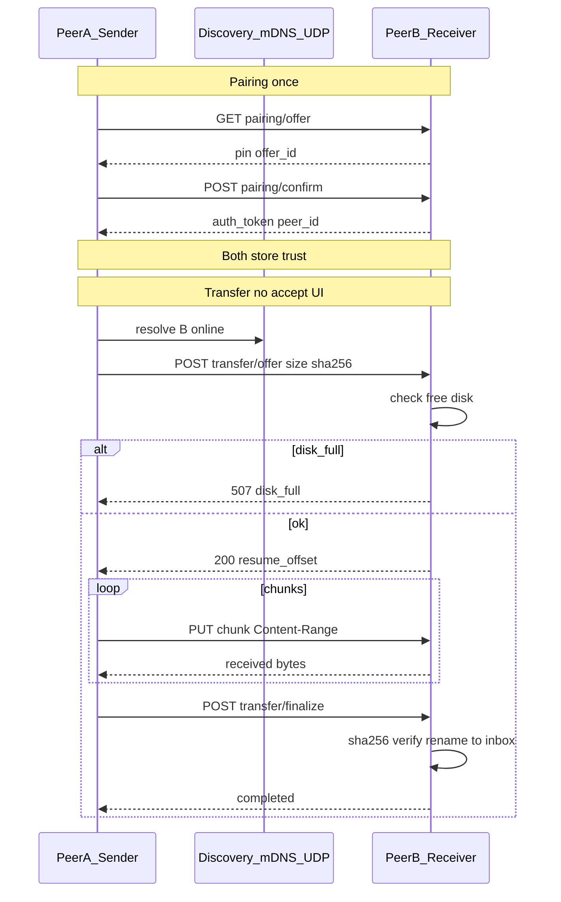

# HomeShare — подробный план разработки

Документ опирается на [roadmap.md](roadmap.md) (инфраструктура MeshPad) и требования к продукту: равноправные peers в LAN, только файлы, авто-приём без подтверждения, pairing PIN/QR, прогресс 0–100%, проверка места на диске, Windows context submenu, Android Share, Linux headless + Web UI в стиле MeshPad Hub (`:8787`).

После утверждения этого плана полный текст сохраняется в [PLAN.md](PLAN.md) в корне репозитория.

---

## 1. Цель проекта

Создать **HomeShare** — кроссплатформенную систему быстрой передачи файлов внутри одной локальной сети без облака и без выделенного центрального сервера.

### 1.1. Продуктовые свойства

- **Windows** — Flutter UI + tray + интеграция в контекстное меню Проводника (иконка + динамическое подменю адресатов).
- **Android** — Flutter UI + Share Intent + уведомление с прогрессом в шторке.
- **Linux** — headless-демон (равноправный peer) + встроенный Web UI для pairing/устройств/логов; inbox-директория из конфиг-файла.
- Все узлы **равноправны**: любой peer может отправлять и принимать.
- Передача стартует **сразу** после выбора адресата; приёмник **не спрашивает подтверждение**, пишет в inbox.
- Только **файлы** (любые типы/размеры при достаточном месте). Папки передаются как дерево файлов с манифестом (не как «текст/заметки»).
- Размер не ограничен искусственно; перед стартом — **расчёт свободного места** на приёмнике.
- Прогресс **0–100%** в UI, в Windows tray (цифрами) и в Android-уведомлении.

### 1.2. Ключевые отличия от MeshPad

| MeshPad | HomeShare |
|---------|-----------|
| Sync заметок LWW + attachments | Transfer jobs: файл / дерево файлов |
| Ack после meta+attachments | Ack только после полной записи + SHA-256 |
| Hub store-and-forward для notes | Linux — обычный peer с inbox на диске |
| Cascade sync | Не нужен: явная точка-точка «кому отправил» |
| Подтверждения UX sync | Авто-приём без confirm |

Сохранить из MeshPad: local-first, pairing PIN/QR, discovery mDNS+UDP, HTTP wire, auth token + подпись, outbox, chunked resume, разделение core/p2p/ui.

---

## 2. Архитектура монорепозитория

```
HomeShare/
├── packages/
│   ├── homeshare_core/      # модели, outbox, hash, disk, crypto, config — без Flutter
│   └── homeshare_p2p/       # discovery, pairing, HTTP transport, transfer coordinator
├── apps/
│   ├── homeshare/          # Flutter: Windows + Android
│   └── homeshare_server/   # Linux AOT + встроенный Web UI
├── native/
│   └── windows_shell/      # COM shell extension (динамическое подменю)
├── scripts/                # setup, bootstrap, build-*, deploy-hub, firewall
├── docs/                   # ARCHITECTURE, TRANSFER_WIRE, HUB, SECURITY, DEVELOPMENT
├── roadmap.md
└── PLAN.md
```

Управление: **melos** + PowerShell (`dev.ps1`, `scripts/*.ps1`) по образцу MeshPad.

### 2.1. `homeshare_core`

Ответственность: всё, что можно тестировать без сети и без Flutter.

Модули:

- `models/` — `PeerId`, `TrustedPeer`, `TransferJob`, `TransferState`, `FileEntry`, `Manifest`, `DiskSpaceReport`.
- `outbox/` — персистентная очередь на диске (JSON files или Drift/SQLite). Состояния: `pending`, `offering`, `transferring`, `verifying`, `completed`, `failed`, `paused`, `cancelled`.
- `hash/` — потоковый SHA-256 (не грузить файл целиком в RAM).
- `disk/` — свободное место, атомарная запись во временный файл → rename, sanitize путей, уникализация имён (`file (1).ext`).
- `crypto/` — device identity (HMAC seed), auth token storage helpers, random PIN.
- `config/` — `AppConfig`: `display_name`, `inbox_dir`, ports, trusted peers index (без секретов в plaintext рядом с публичными метаданными).

Инвариант: **ack / `completed` только после verify SHA-256 на приёмнике**.

### 2.2. `homeshare_p2p`

- `discovery/` — mDNS `_homeshare._tcp` + UDP beacon `:45837`.
- `pairing/` — offer/confirm, один host — один guest за сессию PIN.
- `transport/` — HTTP server (`shelf`) + client; chunked PUT с resume offset.
- `transfer/` — `TransferCoordinator`: offer → space check → stream chunks → finalize → verify.
- `auth/` — `X-HomeShare-Peer-Id`, `X-HomeShare-Auth-Token`, timestamp + HMAC signature.
- `protocol/` — версия wire (`v1`), коды ошибок (`disk_full`, `auth_required`, `path_invalid`, …).

### 2.3. `apps/homeshare` (Flutter)

Экраны:

1. **Устройства** — trusted peers, online/offline, добавить (PIN/QR), отвязать.
2. **Передачи** — активные/история, progress bar + %, отмена, retry.
3. **Настройки** — inbox folder (Win/Android picker), имя устройства, диагностика сети.
4. **Выбор адресата** — быстрый экран при запуске из Explorer/Share Intent.

Сервисы:

- Tray (Windows): свернуть в трей; при передаче tooltip/текст **«N%»** (0–100).
- Notifications (Android foreground service).
- Local agent HTTP на `127.0.0.1` (для shell extension и single-instance).
- CLI args: `--background`, `--send <paths…>`, `--target <peer_id>`.

### 2.4. `apps/homeshare_server` (Linux)

- AOT: `dart compile exe` → `homeshare-hub`.
- systemd unit + `avahi-daemon`.
- Конфиг `/etc/homeshare/config.json` (или `~/.config/homeshare/config.json`):

```json
{
  "display_name": "HomeShare-Linux",
  "inbox_dir": "/var/homeshare/inbox",
  "web_port": 8787,
  "p2p_port": 45838,
  "discovery_port": 45837,
  "data_dir": "/var/lib/homeshare"
}
```

- Отправка с Linux в v1: CLI `homeshare-hub send --to <peer> <files…>` (равноправие без GUI).
- Web UI — см. §5.

### 2.5. Windows Shell Extension (`native/windows_shell`)

Лёгкий **Explorer COM context menu handler** (C++/ATL):

- Пункт с **иконкой** HomeShare.
- **Динамическое подменю**: имена online trusted peers (запрос к агенту `http://127.0.0.1:<agent_port>/v1/peers/online` с таймаутом ~150–300 ms).
- Клик → `homeshare.exe --send "path" --target <peer_id>` (или named pipe).
- Если агент не запущен — один пункт «HomeShare не запущен».
- Не делать тяжёлой работы в процессе Explorer: только кэш + короткий HTTP.

Порядок внедрения (из roadmap §6.9): сначала агент + окно выбора адресата по `--send`, затем shell submenu — но submenu **обязателен** в продукте, не «опциональный MVP-костыль».

---

## 3. Сетевая модель и порты



| Порт | Назначение |
|------|------------|
| `45837/udp` | Discovery beacon |
| `45838/tcp` | Pairing + transfer HTTP |
| `45840/tcp` | HTTPS (pinned cert) — волна 2 |
| `8787/tcp` | Linux Web UI only |
| `127.0.0.1:random/fixed` | Windows local agent API для shell |

mDNS тип: `_homeshare._tcp`. Fallback: ручной IP + PIN (AP isolation).

---

## 4. Wire Protocol (черновик → `docs/TRANSFER_WIRE.md`)

Префикс: `/homeshare/p2p/`.

### 4.1. Pairing

- `GET /homeshare/p2p/pairing/offer` → `{ offer_id, pin, display_name, peer_id, http_port }`
- `POST /homeshare/p2p/pairing/confirm` → обмен identity + `auth_token` + `signing_public_key` + `tls_cert_sha256`
- QR payload: `homeshare://pair?host=<ip>&port=45838&pin=123456`
- PIN: 6 цифр, TTL ~2 мин, refresh вручную; **один guest** на активный offer.

### 4.2. Transfer (без accept от пользователя)

1. `POST /homeshare/p2p/transfer/offer`

```json
{
  "transfer_id": "uuid",
  "name": "video.mp4",
  "kind": "file",
  "size": 5242880000,
  "sha256": "hex-or-null-until-final",
  "file_count": 1,
  "manifest": null
}
```

Для папки: `kind: "dir"`, `manifest: [{ "path": "a/b.txt", "size": 100, "sha256": "..." }, ...]`, `size` = сумма.

2. Приёмник **сразу** принимает (если trust + место), отвечает:

```json
{ "status": "ready", "resume_offset": 0, "inbox_free_bytes": 123456789 }
```

Коды: `507` / `disk_full`, `401` auth, `403` not trusted, `409` conflict transfer_id.

3. `PUT /homeshare/p2p/transfer/<id>/blob`  
   Headers: `Content-Range`, `X-HomeShare-Path` (для dir), `X-HomeShare-Upload-Offset/Total/Sha256` (как MeshPad attachments).

4. `POST /homeshare/p2p/transfer/<id>/finalize` → verify → atomic move в inbox → `{ "status": "completed" }`.

5. `GET /homeshare/p2p/transfer/<id>/status` → прогресс для UI/отладки.

Промежуточные файлы: `<inbox>/.homeshare-tmp/<transfer_id>/...`, наружу не показывать.

### 4.3. Целостность и место

- Перед offer-accept: `required_bytes = size + safety_margin` (например +64 MiB или 1%).
- Если `free < required` → отказ **до** записи.
- SHA-256: для больших файлов можно считать на лету у отправителя параллельно с upload; на приёмнике — при записи; finalize сверяет.
- Resume: при повторном offer тот же `transfer_id` → `resume_offset`.

### 4.4. Auth на transfer

Каждый запрос: peer id + token; для мутаций — timestamp ±N мин + Ed25519 signature. TransportException **не** сжигает retry budget outbox.

---

## 5. Linux Web UI (референс MeshPad Hub)

Ориентир: живой UI на `http://192.168.88.48:8787/` — одна узкая карточка (~420px), светлая/тёмная `color-scheme`, статус-badge, QR, крупный PIN, список устройств с «Отвязать», короткий лог, polling ~10 с.

### 5.1. Страница (single-page)

- Заголовок **HomeShare**, версия.
- Badge статуса демона (idle / receiving / error).
- Stats: устройства, активные передачи, свободное место inbox.
- Кнопка «Показать PIN и QR» → панель с QR (`/hub/qr.png?pin=…`), PIN, LAN endpoint.
- Список trusted devices + «Отвязать» / «Отвязать все».
- «Обновить PIN».
- Секция **Лог** — последние события (pairing, receive done/fail, disk_full).
- Без кнопки «синхронизировать заметки» — вместо неё при желании «Статус приёма» / список активных transfer.

### 5.2. API веб-админки (localhost/LAN)

По аналогии с MeshPad:

- `GET /hub/status` — pin, trusted_devices, recent_events, inbox_path, free_bytes, active_transfers.
- `POST /hub/pairing/refresh`
- `GET /hub/qr.png?pin=`
- `POST /hub/devices/<id>/revoke`
- `POST /hub/devices/revoke-all`

Inbox path меняется **только через config.json** + restart (или API `POST /hub/config/inbox` с записью в файл — зафиксировать один способ в реализации: **файл конфига**, Web UI показывает путь read-only + подсказка).

### 5.3. Внешний вид

Скопировать паттерн MeshPad Hub (простая вёрстка, без тяжёлого SPA-фреймворка): встроенный HTML/CSS/JS в assets сервера. Адаптировать тексты под файловый обмен.

---

## 6. Платформенный UX

### 6.1. Windows

1. Установка (Inno Setup): exe, автозапуск агента, firewall script, регистрация shell extension + иконка.
2. Обычный режим: окно Devices / Transfers / Settings; закрытие → трей.
3. Контекстное меню: файл/папка → HomeShare → подменю peers → мгновенная постановка в outbox.
4. Окно Transfers + tray **«42%»** во время отправки/приёма.
5. Toast/notify: «Отправка начата», «Доставлено», «Недостаточно места у получателя», «Нужно заново связать устройство».

### 6.2. Android

1. Intent filters `SEND` / `SEND_MULTIPLE`, `mimeType=*/*`.
2. Экран «Кому» со списком trusted (online сверху).
3. Foreground service + notification progress 0–100%.
4. Настройки: выбор inbox через SAF/file picker.
5. Pairing: ввод PIN / QR scanner.

### 6.3. Linux

1. systemd always-on peer.
2. Web UI для trust management.
3. CLI send для равноправия.
4. Файлы только в `inbox_dir` из конфига.

---

## 7. Outbox, прогресс, устойчивость

- На «Отправить» → запись job на диск → UI «в очереди» → coordinator.
- Параллелизм: 1–2 исходящих transfer (настраиваемо).
- Progress: `transferred_bytes / total_bytes` → percent для UI/tray/notification; обновление не чаще ~200–500 ms.
- Offline peer: job остаётся `pending`, UI «не в сети», без ложного fail.
- Mid-transfer kill → после рестарта resume по offset.
- Failed jobs не чистить автоматически при старте.
- Имена в inbox: сохранить original name; коллизия → `name (n).ext`.
- Path traversal в manifest: reject (`..`, абсолютные пути, NUL).

---

## 8. Стек и сборка

| Компонент | Технология |
|-----------|------------|
| Язык | Dart 3 |
| UI | Flutter (Win/Android) |
| Monorepo | melos |
| HTTP | shelf / http |
| Discovery | multicast_dns / bonsoir + raw UDP |
| DB очереди | **JSON file store** (atomic per-job files). Drift/SQLite — только если появятся гонки concurrent writers |
| Crypto | package crypto + HMAC-SHA256 over device seed (PIN pairing достаточно; Ed25519 не цель) |
| Win installer | Inno Setup 6 |
| Win shell | C++ ATL COM |
| Linux | dart compile exe + systemd + avahi |
| CI | GitHub Actions: `ci.yml` на PR; `build-release.yml` на тег `v*` → GitHub Release |

Скрипты-ориентиры: `setup.ps1`, `bootstrap.ps1`, `build-windows.ps1`, `build-android.ps1`, `deploy-hub.ps1`, `allow-homeshare-firewall.ps1`, `dev.ps1`.

---

## 9. Этапы реализации

### Этап 0 — Каркас репозитория (3–5 дней)

Melos workspace, пустые пакеты, CI analyze/format, `docs/` заготовки, версия `0.1.0`.

### Этап 1 — Core + P2P skeleton (1–2 недели)

Discovery health, pairing offer/confirm, trusted store, unit/integration harness с двумя in-process HTTP servers.

### Этап 2 — Transfer одного файла (1–2 недели)

Offer → disk check → chunked PUT → finalize → sha256 → outbox ack. E2E тест. Resume после обрыва.

### Этап 3 — Директории (1 неделя)

Manifest, per-file state, partial, sanitize paths, прогресс по сумме байт.

### Этап 4 — Linux server + Web UI (1–2 недели)

AOT hub, systemd, inbox writer, UI как MeshPad Hub (PIN/QR/devices/log). Ручной прогон с `192.168.x.x:8787`.

### Этап 5 — Flutter Windows UI + tray (1–2 недели)

Devices/Transfers/Settings, background agent, tray percent, `--send` → экран/прямая отправка.

### Этап 6 — Android Share (1–2 недели)

Share intent, peer picker, FGS + notification progress, inbox picker.

### Этап 7 — Windows shell submenu (1–2 недели)

COM extension + installer registration + иконка; кэш peers; fail-safe если агент мёртв.

### Этап 8 — Полировка и релиз (1–2 недели)

Firewall docs, dual-device тесты, большие файлы (>4/8 GB), changelog, подписанный APK, Inno setup.

**Итого ориентир: ~10–14 недель** до v1.0 при последовательной работе.

---

## 10. Тестирование (обязательный набор)

Из roadmap §6.5, адаптировано:

- Outbox enqueue → fail mid-file → resume → ack only after sha256.
- Dir: один файл fail → остальные + partial.
- Coordinator: один peer down → не роняет другие jobs.
- TransportException не bump'ает retries.
- 401/403 → re-pair UX, peer остаётся в discovery.
- Pairing: оба конца trusted.
- Chunked resume.
- Hub: inbox write + path traversal reject.
- E2E in-process file+dir.
- Ручное: Win↔Android, Win↔Linux, firewall до/после, kill mid-transfer, disk full simulation.

---

## 11. Документация

- `README.md` — установка и сценарии.
- `docs/ARCHITECTURE.md`
- `docs/TRANSFER_WIRE.md` — единственный контракт сети.
- `docs/HUB.md` — Linux + Web UI API.
- `docs/SECURITY.md` — threat model LAN, pairing, tokens.
- `docs/DEVELOPMENT.md` — bootstrap/build.
- `USER_GUIDE.md` — коротко для пользователя.

---

## 12. Риски и смягчение

- **AP isolation / mDNS** — fallback IP+PIN; UDP beacon в дополнение к mDNS.
- **Windows Firewall** — allow-скрипт в установщике.
- **Explorer hang от shell ext** — только localhost + timeout + cache.
- **Android OEM kills** — FGS + outbox + resume; не обещать вечный silent background.
- **Файлы >2GB** — только streaming, никаких `readAsBytes`.
- **Disk full mid-write** — pre-check + мониторинг free во время длинной передачи; abort + cleanup tmp.
- **Коллизии имён / path traversal** — sanitize + unique names.
- **Асимметрия trust** — confirm транзакционно пишет оба конца.
- Не начинать с shell extension до стабильного transfer+agent.

---

## 13. Критерии готовности v1.0

- [ ] Pairing PIN/QR Win↔Android↔Linux
- [ ] Отправка файла любого типа без confirm на приёме
- [ ] Проверка места до старта; понятная ошибка disk_full
- [ ] Прогресс 0–100% в окне; Windows tray цифрами; Android notification
- [ ] Resume после обрыва
- [ ] SHA-256 verify
- [ ] Windows: иконка + submenu адресатов в Explorer
- [ ] Android: Share → список адресатов → передача
- [ ] Linux: config inbox + Web UI QR/PIN/revoke/log на `:8787`
- [ ] Все peers равноправны (Linux send через CLI)
- [ ] Документы wire + installers + firewall notes
- [ ] Package-тесты + ручной dual-device прогон

---

## 14. Заключение

HomeShare строится как «MeshPad transport − notes sync + file transfer plane»: тот же LAN/pairing/outbox-каркас, новый data plane под файлы. Главный риск — не UI, а надёжная доставка при обрывах; shell submenu и Share Intent — тонкая оболочка над стабильным агентом. Порядок работ: **protocol & outbox → file/dir transfer → Linux hub UI → Flutter clients → Android Share → Windows shell submenu → release**.
